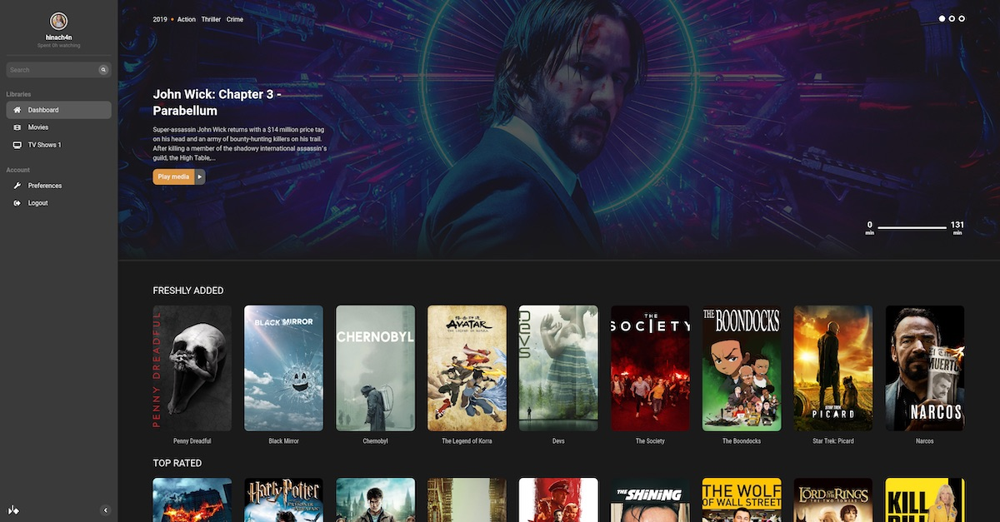
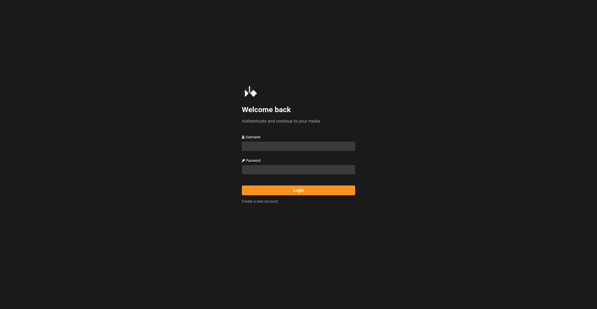
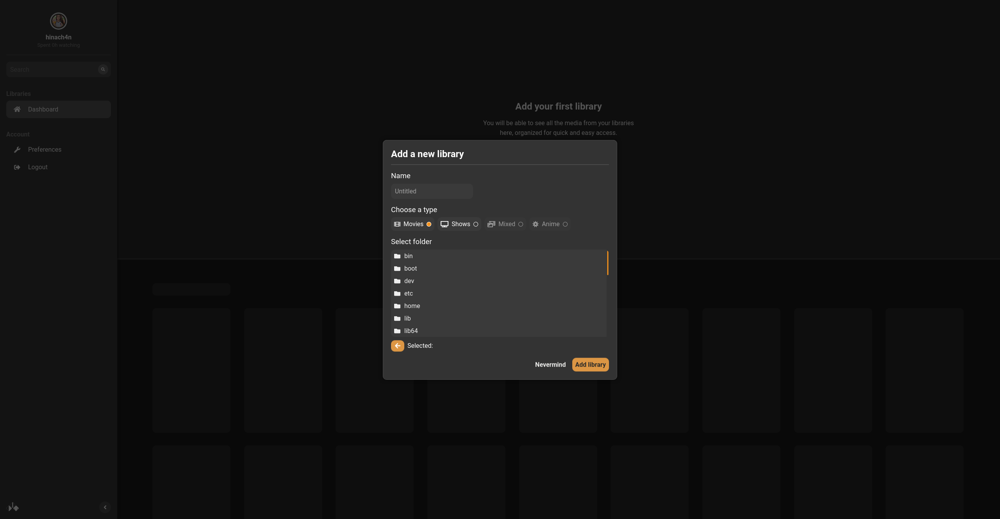
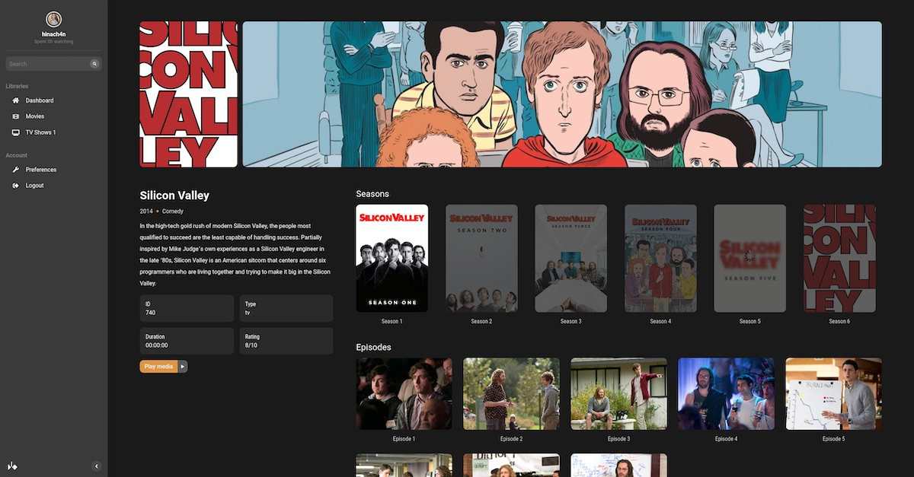

<h1 align="center">Dim</h1>


[](https://discord.gg/gBPyQ7NVah)

Dim is a self-hosted media manager. With minimal setup, Dim will organize and beautify your media collections, letting you access and play them anytime from anywhere.

## Running from binaries

### Dependencies

* libva2
* libva-drm2
* libharfbuzz
* libfontconfig
* libfribidi
* libtheora
* libvorbis
* libvorbisenc
* libtheora0

You can then obtain binaries from the release tab in github:

1. Unpack with `unzip ./release-linux.zip && tar -xvzf ./release.tar.gz`
2. Run `cd release && ./dim`
3. Then you can access the Dim web UI through your browser with `http://0.0.0.0:8000` (assuming it's running locally.)

## Running with docker

The following command runs dim on port 8000, storing configuration in `$HOME/.config/dim`.
You may change that path if you'd like to store configuration somewhere else.
You can mount as many directories containing media as you like by repeating the `-v HOST_PATH:CONTAINER_PATH` option.
In this example, the path `/media` on the host is made available at the same path inside the Docker container.
This name "media" is arbitrary and you can choose whatever you like.

```
docker run -d -p 8000:8000/tcp -v $HOME/.config/dim:/opt/dim/config -v /media:/media:ro ghcr.io/dusk-labs/dim:dev
```
Mutiarch image resides at `ghcr.io/dusk-labs/dim:master`

To use hardware acceleration, mount the relevant device:

```
docker run -d -p 8000:8000/tcp -v $HOME/.config/dim:/opt/dim/config -v /media:/media:ro --device=/dev/dri/renderD128 ghcr.io/dusk-labs/dim:dev
```

Refer to [docker-compose-template.yaml](https://github.com/Dusk-Labs/dim/blob/master/docker-compose-template.yml) to run dim using Docker Compose.

## Running from source

### Dependencies

To run from source, you'll first need to install the following dependencies on your system:

* sqlite
* cargo
* rustc (nightly)
* yarn, npm
* libssl-dev
* libva2 (only if you're using Linux)
* libva-dev (only if you're using Linux)
* libva-drm2 (only if you're using Linux)
* ffmpeg

Once the dependencies are installed, clone the repository and build the project:

```
git clone https://github.com/Dusk-Labs/dim
yarn --cwd ui/ && yarn --cwd ui/ build
mkdir utils && ln -nfs $(which ffmpeg) utils/ffmpeg && ln -nfs $(which ffprobe) utils/ffprobe
```

If you're on Linux, run dim with:

```
cargo run --features vaapi --release
```

On other platforms where libva isn't available, run dim with:

```
cargo run --release
```

## License

Dim is licensed under the AGPLv3 license (see [LICENSE.md](LICENSE.md) or https://opensource.org/licenses/AGPL-3.0)

## Screenshots




